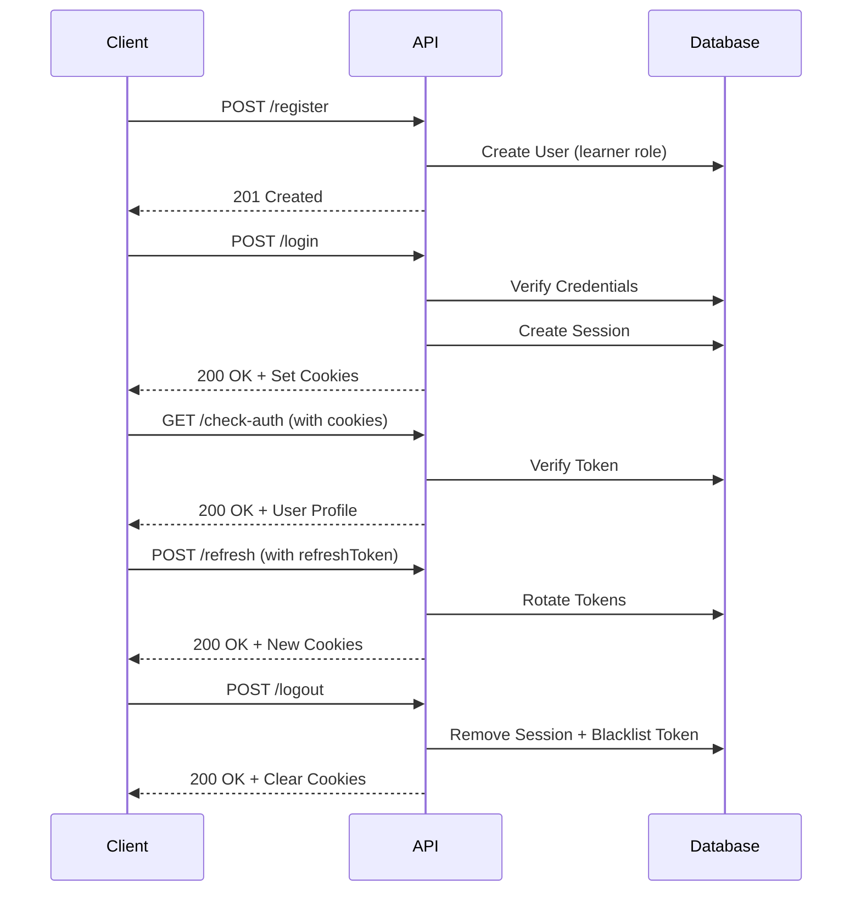

# Authentication API Reference

> **Version:** 2.0.0  
> **Base URL:** `http://localhost:5000/api/auth`  
> **Authentication:** HttpOnly Cookies (`accessToken`, `refreshToken`)

---

## Table of Contents

- [Overview](#overview)
- [Authentication Flow](#authentication-flow)
- [API Endpoints](#api-endpoints)
  - [User Registration](#post-register)
  - [User Login](#post-login)
  - [Token Refresh](#post-refresh)
  - [Check Authentication](#get-check-auth)
  - [Logout (Current Device)](#post-logout)
  - [Logout (All Devices)](#post-logout-all)
  - [Become Instructor](#post-become-instructor)
  - [Submit Enrollment](#post-submit-enrollment)
  - [Admin Approval](#post-admin-approve)
  - [Password Reset Request](#post-forgot-password)
  - [Password Reset](#post-reset-password)
  - [Google One Tap](#post-googleone-tap)
- [Security Features](#security-features)
- [Error Handling](#error-handling)
- [Rate Limiting](#rate-limiting)

---

## Overview

The Kattraan LMS Authentication API provides secure user authentication using **HttpOnly cookies** and **JWT tokens**. All sensitive data, including user roles and passwords, are never exposed in API responses.

### Key Features

- ✅ **HttpOnly Cookie-Based Authentication** - Prevents XSS token theft
- ✅ **UUID-Based Role System** - Non-sequential, non-guessable role identifiers
- ✅ **Token Rotation** - Automatic refresh token rotation on every use
- ✅ **Session Management** - Maximum 3 concurrent sessions per user
- ✅ **Token Blacklisting** - Revoked tokens are immediately invalidated
- ✅ **Audit Logging** - Complete activity tracking for security forensics
- ✅ **Rate Limiting** - Protection against brute-force attacks

---

## Authentication Flow



---

## API Endpoints

### POST /register

Create a new user account with learner role.

**Request**

```http
POST /api/auth/register HTTP/1.1
Content-Type: application/json

{
  "userName": "John Doe",
  "userEmail": "john.doe@gmail.com",
  "password": "SecurePass@123"
}
```

**Success Response** `201 Created`

```json
{
  "success": true,
  "message": "Registered successfully"
}
```

**Error Responses**

| Status | Message | Cause |
|--------|---------|-------|
| `400` | Only @gmail.com email addresses are allowed | Non-Gmail email provided |
| `400` | Password must be at least 8 characters... | Weak password |
| `500` | System configuration error | Role not found in database |

**Validation Rules**

- ✅ `userName`: Required, string
- ✅ `userEmail`: Required, must end with `@gmail.com`
- ✅ `password`: Minimum 8 characters, must include:
  - Uppercase letter (A-Z)
  - Lowercase letter (a-z)
  - Number (0-9)
  - Special character (!@#$%^&*)

**Security Notes**

> [!IMPORTANT]
> - User is automatically assigned **learner role** (UUID-based)
> - Client cannot specify roles - backend controls all role assignments
> - No user data is returned in response (zero data exposure)

---

### POST /login

Authenticate user and establish session.

**Request**

```http
POST /api/auth/login HTTP/1.1
Content-Type: application/json

{
  "userEmail": "john.doe@gmail.com",
  "password": "SecurePass@123"
}
```

**Success Response** `200 OK`

```json
{
  "success": true,
  "message": "Login successful"
}
```

**Cookies Set**

```
Set-Cookie: accessToken=eyJhbGc...; Path=/; HttpOnly; Secure; SameSite=Strict; Max-Age=900
Set-Cookie: refreshToken=eyJhbGc...; Path=/; HttpOnly; Secure; SameSite=Strict; Max-Age=604800
```

**Error Responses**

| Status | Message | Cause |
|--------|---------|-------|
| `400` | Email and password required | Missing credentials |
| `401` | Invalid credentials | Wrong email or password |
| `429` | Too many login attempts | Rate limit exceeded (10 attempts/15min) |

**Session Management**

- Maximum **3 concurrent sessions** per user
- Oldest session is automatically removed when limit exceeded
- Each session tracks: IP address, User Agent, last activity timestamp

**Security Notes**

> [!WARNING]
> - **No user data** is returned in login response
> - Use `/check-auth` endpoint to retrieve user profile after login
> - Tokens are stored in **HttpOnly cookies** (not accessible via JavaScript)

---

### POST /refresh

Rotate tokens and extend session lifetime.

**Request**

```http
POST /api/auth/refresh HTTP/1.1
Cookie: refreshToken=eyJhbGc...
```

**Success Response** `200 OK`

```json
{
  "success": true,
  "message": "Token refreshed"
}
```

**Cookies Set**

```
Set-Cookie: accessToken=<NEW_TOKEN>; Path=/; HttpOnly; Secure; SameSite=Strict; Max-Age=900
Set-Cookie: refreshToken=<NEW_TOKEN>; Path=/; HttpOnly; Secure; SameSite=Strict; Max-Age=604800
```

**Error Responses**

| Status | Message | Cause |
|--------|---------|-------|
| `401` | No refresh token | Cookie not provided |
| `403` | Invalid refresh token (session not found) | Token not in database |
| `403` | Session expired | Token expired |

**Token Rotation**

> [!IMPORTANT]
> This endpoint implements **automatic token rotation**:
> - Both `accessToken` and `refreshToken` are replaced with new tokens
> - Old refresh token becomes **immediately invalid**
> - Session `lastActive` timestamp is updated
> - Session expiration is extended by 7 days

---

### GET /check-auth

Verify authentication status and retrieve user profile.

**Request**

```http
GET /api/auth/check-auth HTTP/1.1
Cookie: accessToken=eyJhbGc...
```

**Success Response** `200 OK`

```json
{
  "success": true,
  "message": "Authenticated user!",
  "data": {
    "user": {
      "_id": "507f1f77bcf86cd799439011",
      "userName": "John Doe",
      "userEmail": "john.doe@gmail.com",
      "googleId": null,
      "status": "active",
      "enrollmentData": {}
    }
  }
}
```

**Error Responses**

| Status | Message | Cause |
|--------|---------|-------|
| `401` | User is not authenticated | No token provided |
| `401` | Invalid or expired token | Token verification failed |
| `401` | Token revoked | Token is blacklisted |

**Excluded Fields** (Never Exposed)

- `password` - Hashed password
- `sessions` - Active session data
- `roles` - UUID role identifiers
- `resetPasswordToken` - Password reset token
- `resetPasswordExpires` - Token expiration
- `__v` - MongoDB version key

---

### POST /logout

Terminate current session and clear cookies.

**Request**

```http
POST /api/auth/logout HTTP/1.1
Cookie: accessToken=eyJhbGc...; refreshToken=eyJhbGc...
```

**Success Response** `200 OK`

```json
{
  "success": true,
  "message": "Logged out successfully"
}
```

**Cookies Cleared**

```
Set-Cookie: accessToken=; Path=/; Expires=Thu, 01 Jan 1970 00:00:00 GMT
Set-Cookie: refreshToken=; Path=/; Expires=Thu, 01 Jan 1970 00:00:00 GMT
```

**Logout Process**

1. Access token is added to **blacklist** (valid until natural expiration)
2. Specific session is removed from user's sessions array
3. Cookies are cleared from browser
4. Other active sessions remain valid

---

### POST /logout-all

Terminate all sessions across all devices.

**Request**

```http
POST /api/auth/logout-all HTTP/1.1
Cookie: accessToken=eyJhbGc...
```

**Success Response** `200 OK`

```json
{
  "success": true,
  "message": "Logged out from all devices"
}
```

**Error Responses**

| Status | Message | Cause |
|--------|---------|-------|
| `401` | User is not authenticated | No valid token |

**Logout Process**

1. All sessions in database are cleared
2. Current access token is blacklisted
3. User must re-login on all devices

> [!CAUTION]
> This action is **irreversible** and will log out the user from all active sessions immediately.

---

### POST /become-instructor

Upgrade learner account to instructor (triggers enrollment flow).

**Request**

```http
POST /api/auth/become-instructor HTTP/1.1
Content-Type: application/json

{
  "userEmail": "john.doe@gmail.com"
}
```

**Success Response** `200 OK`

```json
{
  "success": true,
  "message": "Upgraded to instructor. Please complete enrollment."
}
```

**Error Responses**

| Status | Message | Cause |
|--------|---------|-------|
| `404` | User not found | Invalid email |
| `500` | Instructor role not found | Database configuration error |

**Process Flow**

1. Instructor role UUID is added to user's roles array
2. User status is set to `pending_enrollment`
3. User must complete `/submit-enrollment` before accessing instructor features

---

### POST /submit-enrollment

Submit instructor enrollment application.

**Request**

```http
POST /api/auth/submit-enrollment HTTP/1.1
Content-Type: application/json
Cookie: accessToken=eyJhbGc...

{
  "bio": "Experienced software developer with 10 years in web development",
  "experience": "10 years",
  "expertise": "JavaScript, React, Node.js",
  "linkedin": "https://linkedin.com/in/johndoe",
  "website": "https://johndoe.dev"
}
```

**Success Response** `200 OK`

```json
{
  "success": true,
  "message": "Enrollment submitted. Awaiting admin approval."
}
```

**Error Responses**

| Status | Message | Cause |
|--------|---------|-------|
| `401` | User is not authenticated | No valid token |
| `404` | User not found | Invalid user ID |

**Approval Process**

1. Enrollment data is saved to user document
2. User status is set to `pending_approval`
3. Admin must approve via `/admin-approve` endpoint
4. User gains instructor access after approval

---

### POST /admin-approve

Approve or reject instructor enrollment (Admin only).

**Request**

```http
POST /api/auth/admin-approve HTTP/1.1
Content-Type: application/json
Cookie: accessToken=eyJhbGc...

{
  "userId": "507f1f77bcf86cd799439011",
  "action": "approve"
}
```

**Success Response** `200 OK`

```json
{
  "success": true,
  "message": "Instructor approved successfully"
}
```

**Error Responses**

| Status | Message | Cause |
|--------|---------|-------|
| `401` | User is not authenticated | No valid token |
| `404` | User not found | Invalid user ID |

**Actions**

- `approve` - Sets user status to `approved`, grants instructor access
- `reject` - Sets user status to `rejected`, denies instructor access

---

### POST /forgot-password

Request password reset email.

**Request**

```http
POST /api/auth/forgot-password HTTP/1.1
Content-Type: application/json

{
  "userEmail": "john.doe@gmail.com"
}
```

**Success Response** `200 OK`

```json
{
  "success": true,
  "message": "Password reset email sent"
}
```

**Error Responses**

| Status | Message | Cause |
|--------|---------|-------|
| `400` | Only @gmail.com email addresses are supported | Non-Gmail email |

**Process**

1. Generates unique reset token (valid for **1 hour**)
2. Sends email with reset link: `CLIENT_URL/reset-password?token=<TOKEN>`
3. Returns success even if email not found (security best practice)

> [!NOTE]
> The API returns success regardless of whether the email exists to prevent email enumeration attacks.

---

### POST /reset-password

Reset password using token from email.

**Request**

```http
POST /api/auth/reset-password HTTP/1.1
Content-Type: application/json

{
  "token": "a1b2c3d4e5f6789...",
  "newPassword": "NewSecure@Pass123"
}
```

**Success Response** `200 OK`

```json
{
  "success": true,
  "message": "Password has been reset"
}
```

**Error Responses**

| Status | Message | Cause |
|--------|---------|-------|
| `400` | Token and new password required | Missing fields |
| `400` | Invalid or expired token | Token not found or expired |
| `400` | Password must be at least 8 characters... | Weak password |

**Process**

1. Token is validated (must be within 1-hour window)
2. New password is hashed and stored
3. Reset token is cleared from database

---

### POST /google/one-tap

Authenticate using Google One Tap.

**Request**

```http
POST /api/auth/google/one-tap HTTP/1.1
Content-Type: application/json

{
  "id_token": "eyJhbGciOiJSUzI1NiIsImtpZCI6..."
}
```

**Success Response** `200 OK`

```json
{
  "success": true,
  "message": "Google One Tap login successful"
}
```

**Cookies Set**

```
Set-Cookie: accessToken=eyJhbGc...; Path=/; HttpOnly; Secure; SameSite=Strict; Max-Age=900
Set-Cookie: refreshToken=eyJhbGc...; Path=/; HttpOnly; Secure; SameSite=Strict; Max-Age=604800
```

**Error Responses**

| Status | Message | Cause |
|--------|---------|-------|
| `400` | ID Token is required | Missing token |
| `500` | Authentication failed | Invalid Google token |

**Process**

1. Verifies Google ID token with Google OAuth servers
2. Creates new user if Google account not linked (assigns learner role)
3. Links Google account to existing user if email matches
4. Sets `isVerified: true` for Google-authenticated users
5. Establishes session and sets cookies

---

## Security Features

### 🔒 HttpOnly Cookies

All authentication tokens are stored in **HttpOnly cookies**, making them inaccessible to JavaScript code. This prevents XSS attacks from stealing tokens.

**Cookie Flags:**
- `HttpOnly` - Prevents JavaScript access
- `Secure` - HTTPS only (production)
- `SameSite=Strict` - CSRF protection
- `Path=/` - Available to all routes

### 🔄 Token Rotation

Refresh tokens are **automatically rotated** on every use:
- Old refresh token becomes invalid immediately
- Prevents token replay attacks
- Detects token theft attempts

### 🚫 Token Blacklisting

Logout operations add access tokens to a blacklist:
- Middleware checks blacklist before accepting tokens
- TTL index automatically removes expired tokens
- Immediate token revocation

### 👥 Session Management

- **Maximum 3 concurrent sessions** per user
- Oldest session removed when limit exceeded
- Each session tracks:
  - IP address
  - User Agent
  - Last activity timestamp
  - Expiration time

### 📝 Audit Logging

All authentication events are logged:
- `SIGNUP` - New user registration
- `LOGIN` - Successful login
- `LOGIN_FAILED` - Failed login attempt
- `LOGOUT` - Single device logout
- `LOGOUT_ALL` - All devices logout
- `REFRESH_TOKEN` - Token refresh

Each log entry includes:
- User ID
- IP address
- User Agent
- Timestamp
- Additional metadata

### 🔐 Role Privacy

- Role information is **never exposed** in API responses
- Roles are stored as **UUIDs** (non-sequential, non-guessable)
- Authorization is handled server-side via JWT payload
- Client cannot determine user privileges from API responses

---

## Error Handling

All API responses follow a consistent format:

**Success Response**

```json
{
  "success": true,
  "message": "Operation successful",
  "data": { /* optional response data */ }
}
```

**Error Response**

```json
{
  "success": false,
  "message": "Error description"
}
```

### Common HTTP Status Codes

| Code | Meaning | Usage |
|------|---------|-------|
| `200` | OK | Successful request |
| `201` | Created | Resource created successfully |
| `400` | Bad Request | Validation error or malformed request |
| `401` | Unauthorized | Authentication required or failed |
| `403` | Forbidden | Authenticated but not authorized |
| `404` | Not Found | Resource does not exist |
| `429` | Too Many Requests | Rate limit exceeded |
| `500` | Internal Server Error | Server-side error |

---

## Rate Limiting

Protection against brute-force attacks:

| Endpoint | Limit | Window |
|----------|-------|--------|
| `/login` | 10 requests | 15 minutes |
| All other auth endpoints | 100 requests | 15 minutes |

**Rate Limit Response** `429 Too Many Requests`

```json
{
  "success": false,
  "message": "Too many login attempts. Please try again later."
}
```

---

## Testing

### Using cURL

```bash
# Register
curl -X POST http://localhost:5000/api/auth/register \
  -H "Content-Type: application/json" \
  -d '{"userName":"Test User","userEmail":"test@gmail.com","password":"Test@1234"}'

# Login (save cookies)
curl -X POST http://localhost:5000/api/auth/login \
  -H "Content-Type: application/json" \
  -d '{"userEmail":"test@gmail.com","password":"Test@1234"}' \
  -c cookies.txt

# Check Auth (use saved cookies)
curl -X GET http://localhost:5000/api/auth/check-auth \
  -b cookies.txt

# Logout
curl -X POST http://localhost:5000/api/auth/logout \
  -b cookies.txt
```

### Using Swagger UI

Interactive API testing interface available at:

**http://localhost:5000/api-docs**

> [!TIP]
> Swagger UI automatically manages cookies after login, making it easy to test protected endpoints.

---

## Support

For issues or questions:
- 📧 Email: support@kattraan.com
- 📖 Documentation: [Full API Docs](../API_REFERENCE.md)
- 🔐 Security: [Authentication Deep Dive](../AUTHENTICATION.md)
